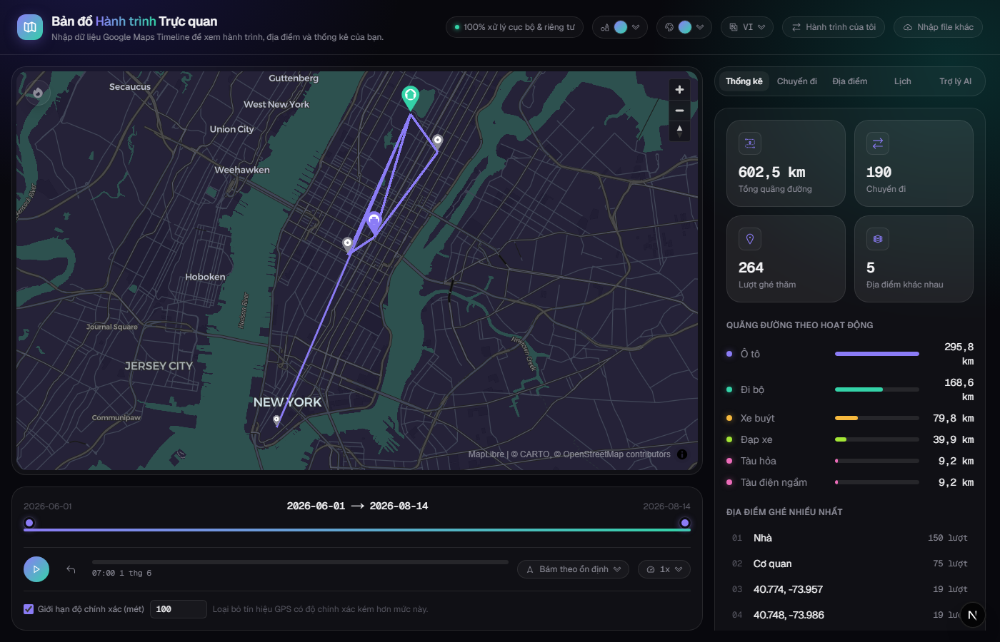
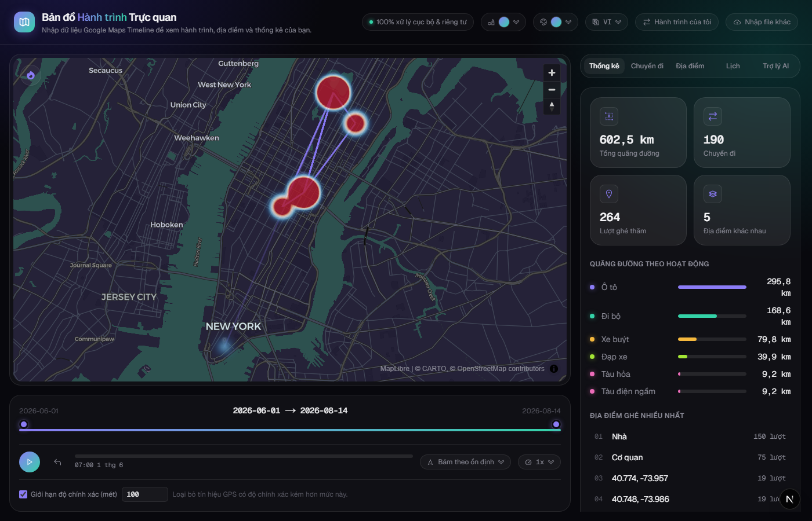
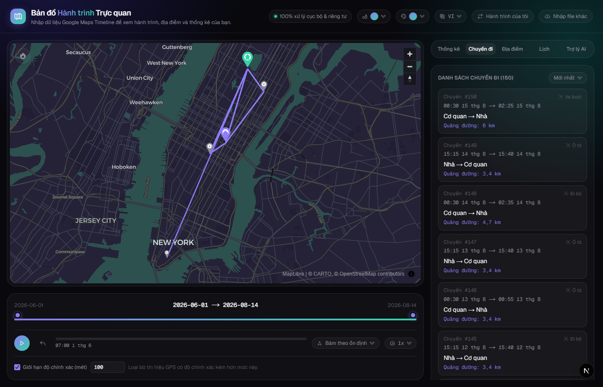
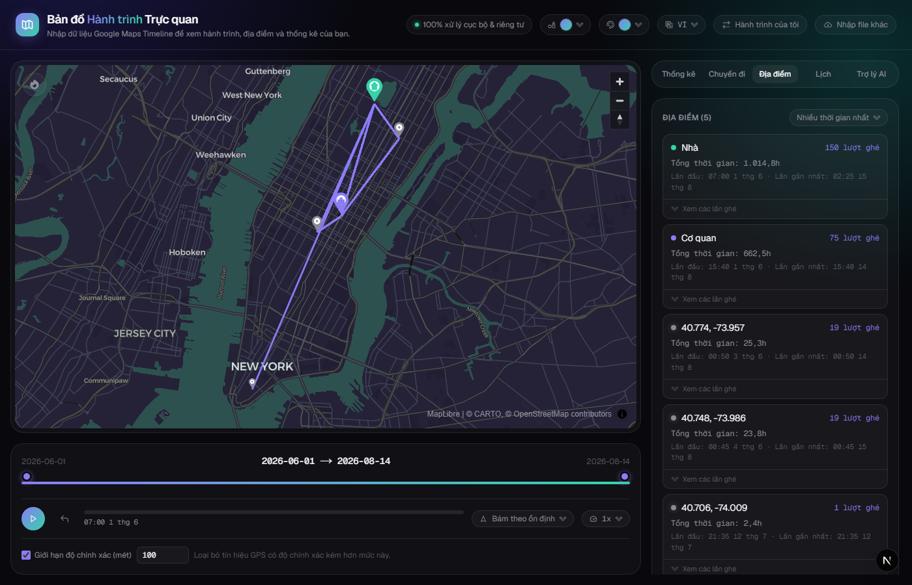
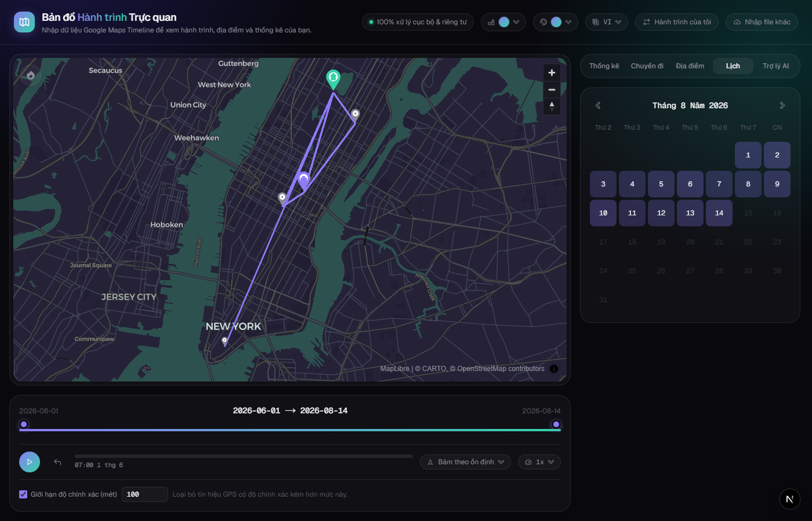
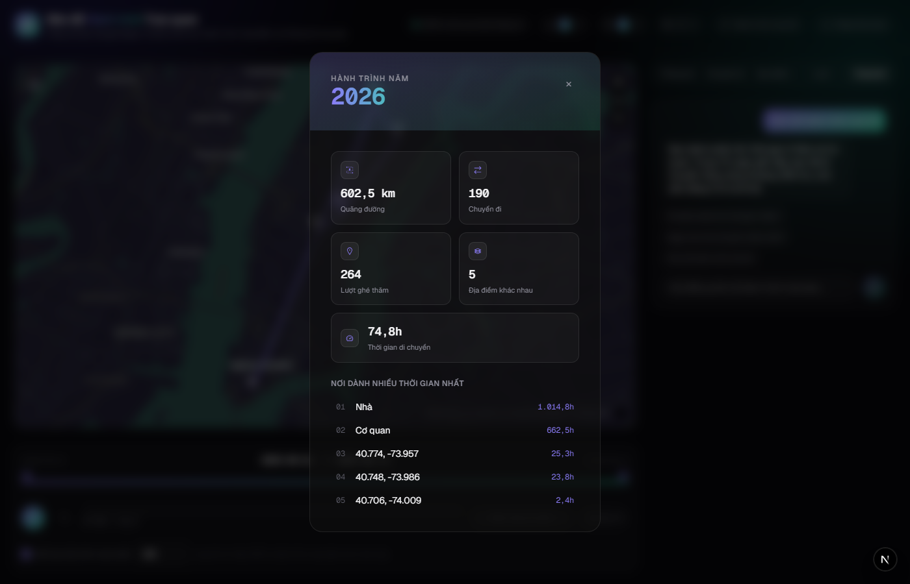
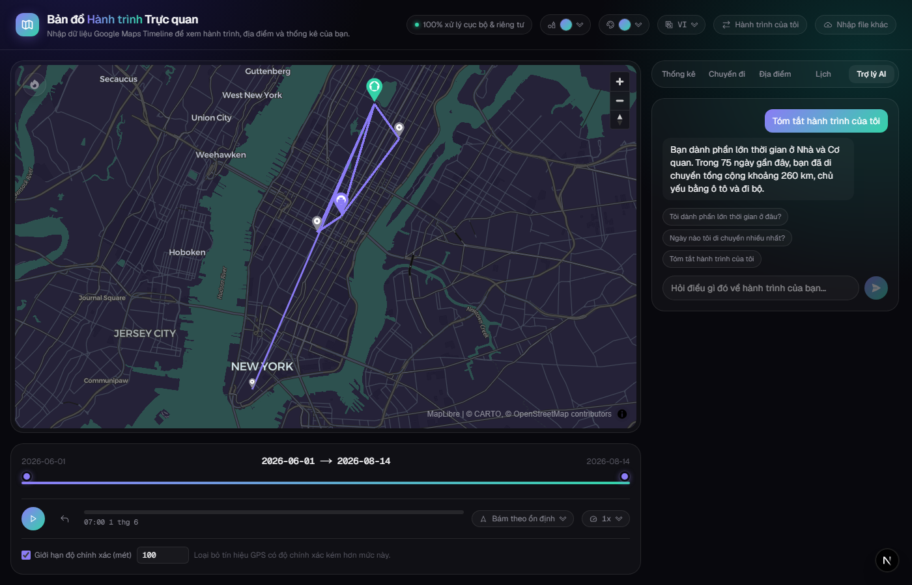
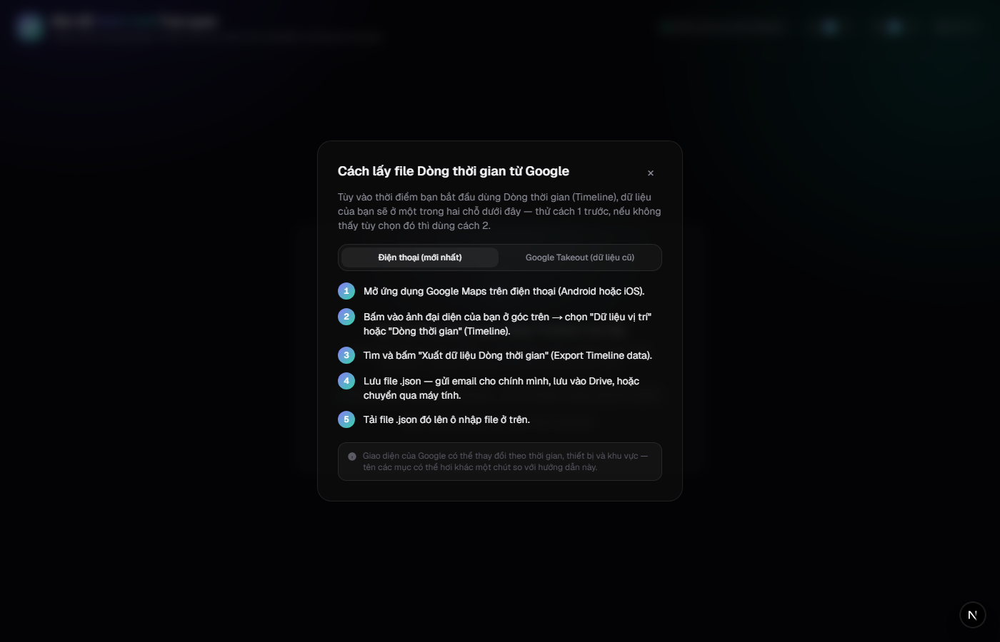

<p align="center">
  
</p>

# Map Timeline Visualizer

Import a Google Maps Timeline export and see your journeys, places, and stats — as a route
map, a replay animation, a heatmap, and a personal "Wrapped"-style recap. Everything runs
**entirely in your browser**: nothing is ever uploaded anywhere.

> 🔒 **100% local & private.** Parsing, analytics, and even the AI assistant (when your
> browser supports it) all run on-device. Your location history never leaves your machine.

## Features

### Route map, replay, and camera modes

Every trip and place from your import is rendered on the map. Hit play to replay your
route like a GPS tracker — the camera can stay fixed, follow steadily, or dynamically
zoom/rotate with your speed and direction.

<p align="center"></p>

### Heatmap

Toggle a density heatmap to see at a glance where you actually spend your time, instead
of reading it off a list.

<p align="center"></p>

### Trips

Individual GPS segments are automatically merged into real trips (a red-light stop or an
activity-type change mid-route doesn't fragment one outing into several). Sort by date or
distance, and select a trip to isolate it on the map.

<p align="center"></p>

### Places

Every place you've visited, clustered from raw GPS pings into one marker per real-world
location — sized by time spent, color-coded by category (home / work / named / other),
with a click for the full visit history.

<p align="center"></p>

### Calendar

Browse month by month — days are shaded by how much distance you covered, and clicking a
day narrows the whole map and timeline to it.

<p align="center"></p>

### My Life Map (Wrapped)

A yearly recap card — total distance, trips, places, travel time, and your most-visited
spots — browsable year by year if your import spans more than one.

<p align="center"></p>

### AI assistant (on-device)

Ask questions about your timeline in plain language. Answered by Chrome/Edge's built-in
on-device model (Gemini Nano) when available — no network call, no cloud API. The
assistant can also drive the app itself (e.g. "show my longest trips" actually sorts and
switches to the trip list).

<p align="center"></p>

### Import guide

Not sure where to find your Timeline export? A built-in step-by-step guide covers both
the current on-device export (Google Maps app) and Google Takeout for older accounts.

<p align="center"></p>

### Also included

- **Themes & styles** — several color themes plus a Gradient/Brutalism visual style, independent of each other.
- **Vietnamese and English**, switchable at any time.
- **GPS accuracy filter** — drop noisy pings below a chosen accuracy threshold; place clustering re-groups automatically to match.

## Supported import formats

The parser auto-detects and handles:

- The current on-device Google Maps Timeline export (`semanticSegments`)
- Legacy Semantic Location History from Google Takeout (`timelineObjects`)
- Raw `Records.json` location pings (`locations`)
- Google Takeout's `Timeline Edits.json` edit log (`timelineEdits`)

See the in-app import guide for how to get one of these from your Google account.

## Getting started

```bash
npm install
npm run dev
```

Open [http://localhost:3000](http://localhost:3000) and drop in your Timeline export.

## Deploying to GitHub Pages

The repo already includes a GitHub Actions workflow (`.github/workflows/deploy.yml`) that
builds a static export and deploys it on every push to `master`. To enable it on your own
fork: **Settings → Pages → Build and deployment → Source → GitHub Actions**.

## Tech stack

- [Next.js](https://nextjs.org) (App Router, static export) + TypeScript
- [MapLibre GL JS](https://maplibre.org/) with CARTO basemaps, re-tinted per theme
- [Tailwind CSS](https://tailwindcss.com)
- No backend, no database, no analytics — the whole app is static files
